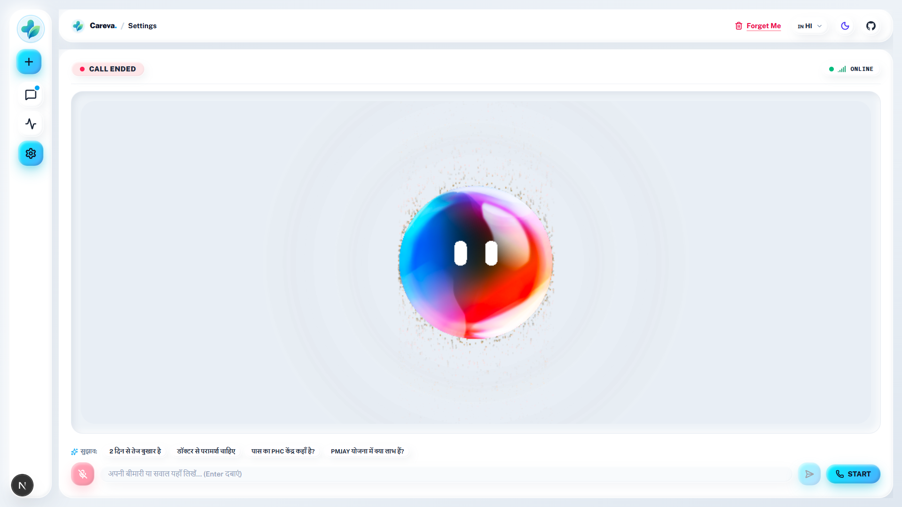
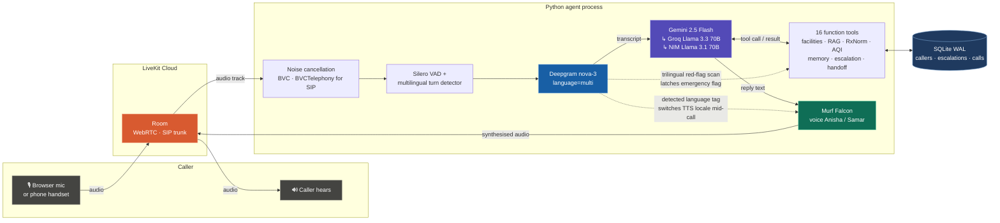
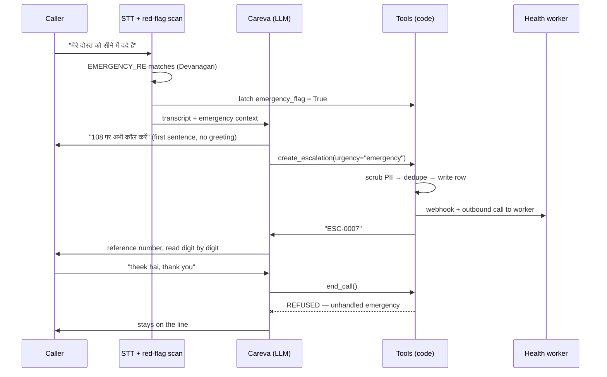
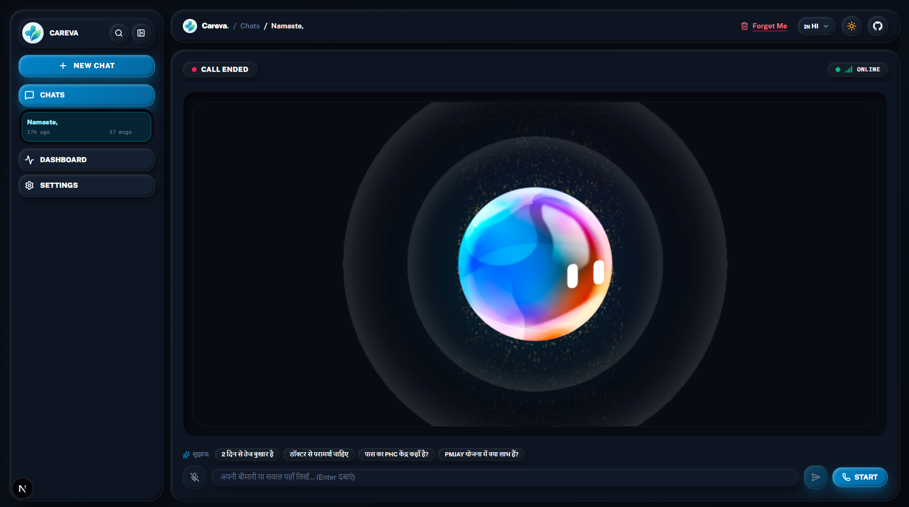
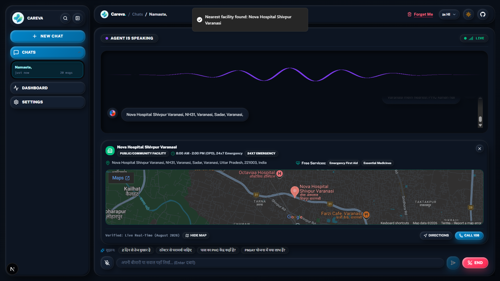
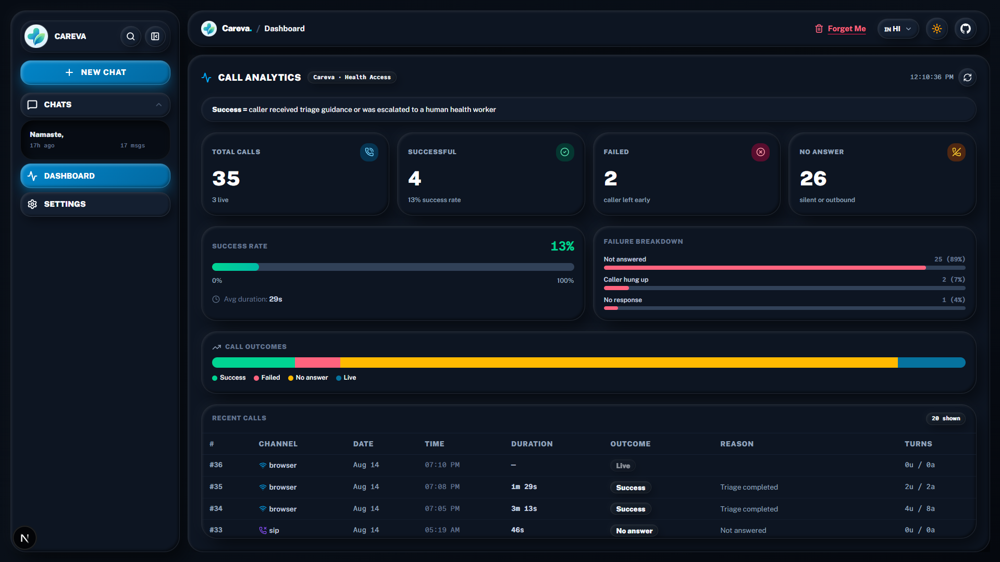
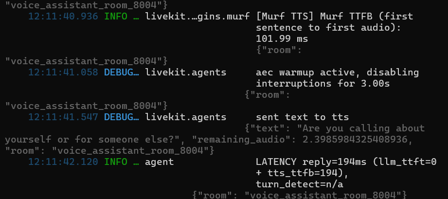

<div align="center">


# Careva

### A Voice-First Health Helpline For People Who Cannot Read The Health System

[](https://murf.ai/api/docs/text-to-speech-models/falcon-2)
[](https://docs.livekit.io/agents)
[](https://developers.deepgram.com)
[](https://ai.google.dev)
[](https://www.python.org/)
[](https://nextjs.org)
[](https://sqlite.org)
[](LICENSE)

**10 Days of Voice Agents — VoiceForBharat Edition · Health Access Track**

Hindi & English · Browser & real phone calls · Human escalation · Specialist handoff

</div>

<div align="center">



*A live call. The caller asked, in Hindi, where the nearest PHC is — Careva answered by voice and pushed the facility card, map and a Call 108 button into the session.*

</div>

---

## Why Careva Exists

The person Careva is built for does not have a problem that a website solves.

They have a fever at 9pm and no idea whether the PHC is open. They hold a ₹40 prescription without knowing the same salt costs ₹6 at a Jan Aushadhi store. They qualify for Ayushman Bharat and have never read the eligibility page — because that page is in English, is two thousand words long, and assumes a smartphone with data.

They can talk, though.

Voice here is not a nicer interface. It is the only interface that clears the bar: no app install, no typing in a script your keyboard does not have, no literacy assumption, works on a ₹1,500 feature phone over 2G.

### The gap, in numbers

| Metric | Figure | Source |
| :--- | :--- | :--- |
| Shortfall of specialists at rural Community Health Centres | **79.5%** — 21,920 required, 4,485 available | [Rural Health Statistics 2021-22, via The Hindu](https://www.thehindu.com/todays-paper/tp-opinion/shortfall-of-specialist-doctors-in-rural-areas-was-80-in-2022/article66448586.ece) |
| Functioning CHCs that have all four specialists | **541 of 5,480** | [RHS 2021-22 analysis](https://www.nextias.com/ca/editorial-analysis/21-01-2023/indias-rural-healthcare-system) |
| Household out-of-pocket share of total health spending | **43.4%** (2022-23) | [National Health Accounts, via The Hindu](https://www.thehindu.com/sci-tech/health/out-of-pocket-expenditure-on-health-showsdeclining-trend-states-lates-national-health-accounts/article71029040.ece) |
| Spent by Indian households on medicines alone | **₹1.6 lakh crore** — 21% of current health expenditure | [NHA 2022-23, via TOI](https://timesofindia.indiatimes.com/india/indians-spent-rs-1-6-lakh-crore-on-medicines-in-2022-23-nha/articleshow/131417652.cms) |

> The information that would save someone a wasted trip, a needless private-clinic bill, or an hour in a Golden Hour already exists in public registries and government schemes. It is simply unreachable by the people who need it most.

Careva makes that information answer a phone call.

---

## What Careva Does

Careva answers in the language you spoke to her in — Hindi in Devanagari, or plain Indian English — and never mixes the two in one reply.

| | Capability |
| :--- | :--- |
| 🏥 | **Find the nearest facility.** PHC, CHC or district hospital from a district name or a 6-digit PIN code, with OPD timings, 24x7 emergency status and free services. |
| 📋 | **Explain a scheme.** PM-JAY / Ayushman Bharat, JSSK maternal care, and the Universal Immunization schedule, retrieved from a local knowledge base. |
| 💊 | **Price a medicine honestly.** The generic salt behind a brand name, and the Jan Aushadhi saving. |
| 🌫️ | **Give an environmental advisory.** Live PM2.5 / PM10 / AQI for a district with precautions for asthma and elderly callers. |
| 🧠 | **Remember you** — name, district, age band, ongoing conditions, last triage outcome — but only if you say yes, and forget everything on request. |
| 📞 | **Call you.** Outbound medication and vaccination reminders over a real phone line. |
| 🙋 | **Fetch a human.** A red flag or a decision she must not make creates a case for a health worker, with a spoken reference number. |
| 🔀 | **Hand you to a specialist.** Detailed clinic, doctor-schedule and appointment questions go to Samar, a second agent with a different voice. |
| 🚨 | **Recognise an emergency and say "call 108 now" as the first sentence** — before any greeting, and then refuse to hang up. |

That last row drove most of the engineering in this repo.

---

## Architecture

### How audio moves through the system



The two dotted lines are the parts that are not in the tutorial. Deepgram tags every final transcript with the language actually spoken, and that tag switches the Murf locale mid-call. The same transcript is scanned by a trilingual red-flag regex that latches a flag no amount of LLM cheerfulness can clear.

### Components

| Layer | Technology | Why this one |
| :--- | :--- | :--- |
| **Text-to-speech** | **Murf Falcon** — `Anisha` (main), `Samar` (specialist), style `Conversational`, `text_pacing=True` | Indian voices, and fast enough that the gap after you stop speaking does not read as a dropped call. **Measured 101.99 ms** first-sentence-to-first-audio on this project. |
| **Speech-to-text** | Deepgram `nova-3`, `language="multi"` | One model covers Hindi and English without committing upfront, and it returns the detected language — which this project uses as a control signal, not just metadata. |
| **LLM** | `FallbackAdapter`: Gemini 2.5 Flash → Groq Llama 3.3 70B → Llama 3.1 70B on NVIDIA NIM | A helpline that 502s is worse than a slow one. Both fallbacks are the same Llama family, so voice and Hinglish quality do not lurch on failover. |
| **Transport** | LiveKit Agents 1.4 | One pipeline serves the browser and a real phone number over SIP, with no branching in the agent code. |
| **Turn detection** | LiveKit `MultilingualModel()` + Silero VAD | Semantic end-of-turn beats silence thresholds when a caller pauses mid-sentence to think. |
| **Noise cancellation** | `BVCTelephony()` for SIP participants, `BVC()` for browser | Phone audio is band-limited; the generic model does measurably worse on it. |
| **Frontend** | Next.js 15 + Tailwind, LiveKit React components | Shows agent state, live transcript, pushed facility cards and the analytics dashboard. |
| **Storage** | SQLite in WAL mode (`aiosqlite` from Python, `node:sqlite` from Next.js) | Two processes write one file. WAL and a busy timeout are what make that safe. |
| **Knowledge retrieval** | Hand-rolled BM25 over local markdown (~150 lines, zero dependencies) | At this corpus size an embedding store would be infrastructure with no accuracy gain. |

### The emergency path

The one flow that is not allowed to depend on the model behaving well:



`end_call` and `transfer_to_clinic_specialist` both refuse while `emergency_flag` is set and no escalation exists. This is not a prompt instruction. It is a guard clause in the tool.

---

## Features In Detail

### Voice and language

`MURF_VOICE = "Anisha"` for Careva, `Samar` for the specialist — so a handoff sounds like a different person, not the same voice claiming to be one.

Language handling is three separate mechanisms that are easy to confuse:

1. **Word choice** is the system prompt's job — reply in the language of the caller's *last* message, and never mix. An English caller gets zero Hindi filler words; a Hindi caller gets Devanagari.
2. **Accent** is the TTS locale's job. `session.tts.update_options(locale=...)` is called mid-call off Deepgram's detected-language tag. Synthesising English text through a `hi-IN` voice is what "bad accent" actually was.
3. **Safety scanning** is a regex's job, and it covers English, Roman Hinglish *and* Devanagari — because a caller in distress will not pick a lane.

### Guardrails

- Never prescribes a specific medicine, a dose, or a final diagnosis.
- Emergency instructions override everything, including the greeting and the consent question.
- 1–2 short sentences per turn, then stop and listen. Long turns are unusable on a phone.
- Never promises a callback or a time — it says a worker reviews the case during working hours.
- Escalation is never presented as a substitute for 108.
- Function tags and JSON can never reach audio: a custom `CleanSentenceTokenizer` strips leaked tags in the TTS pipeline itself, so a model slip becomes silence rather than the agent reading XML aloud.
- 10 adversarial cases are documented and run in [RED_TEAM.md](RED_TEAM.md).

### Memory, gated on consent

A `callers` table keyed on the participant identity — which for a SIP caller is the phone number.

Stored: name, language preference, district, age band, ongoing conditions, last triage outcome. Not stored: sensitive medical history, and nothing at all until the caller agrees. `forget_caller` hard-deletes, and the UI exposes it as a **Forget Me** button.

Memory also feeds tool chaining. Ask "where is the nearest PHC?" on a second call and the location argument is left empty by the model, then auto-resolved from the remembered district — which is what makes a return call feel like a continuation instead of a form.

```python
if not loc:
    # Tool chaining: auto-resolve from Day 4 memory
    loc = self.caller_facts.get("district") or self.caller_facts.get("location") or ""
```

### The 16 tools

Careva carries 11; the specialist carries 5. Live sources all have a 2.5–3.5 s budget and a layered fallback.

| Tool | Source | What it does |
| :--- | :--- | :--- |
| `find_nearest_health_facility` | OSM Nominatim + India Post PIN API → curated registry | Nearest PHC/CHC/hospital, OPD timings, free services; also pushes a card to the UI |
| `search_health_guidelines` | Local BM25 over `data/knowledge/*.md` | PM-JAY, JSSK, immunisation schedule, PHC service list |
| `lookup_generic_medicine` | NLM RxNorm REST | Generic salt behind a brand, Jan Aushadhi saving |
| `get_district_health_advisory` | Nominatim + Open-Meteo Air Quality | Live PM2.5 / PM10 / US AQI with clinical precautions |
| `lookup_caller` · `save_caller_info` · `forget_caller` | SQLite `callers` | Consent-gated memory, and its deletion |
| `create_escalation` · `check_escalation_status` | SQLite `escalations` + webhook + outbound call | Human handover and its status read-back |
| `transfer_to_clinic_specialist` | In-session agent swap | Route to Samar |
| `end_call` | — | Say goodbye and shut down — unless an emergency is unhandled |
| `get_facility_details_and_timings` *(specialist)* | Facilities registry | Structured OPD / doctors / registration-token / contact block |
| `transfer_back_to_main_agent` *(specialist)* | In-session agent swap | Return to Careva with state intact |

### Human escalation

Careva escalates in exactly two situations, and no others: a **red flag** (chest pain, breathing trouble, ongoing bleeding, fainting, fits, pregnancy complication, sick newborn, poisoning, suicidal talk, or something worsening despite advice), or a **decision she must not make** (a diagnosis, a dose, permission to skip treatment). Facility lookups, timings, schemes and medicine prices never create a case.

| Design point | How it works |
| :--- | :--- |
| **Permission first** | She asks *"May I send a short summary to a human health worker?"* in the caller's language. A refusal calls the same tool with `consent_given="false"`, which writes nothing at all. |
| **Six fields, never the transcript** | Who, what happened, what was already checked, urgency, language, preferred follow-up. |
| **PII scrub at one choke point** | Phone numbers, Aadhaar, long digit runs, and any short number sitting within 12 characters of `otp`/`pin`/`upi`/`account`/`card` are stripped before the row is written — so storage and the webhook can never diverge. |
| **Clinical numbers survive on purpose** | `108`, `1075`, `14555`, `BP 140/90`, age band `45-55`, `pin code 221002` all pass. A bare `pin 221002` is scrubbed — losing a pincode is cheaper than leaking a PIN. |
| **Speakable reference** | `ESC-0007`, from an `AUTOINCREMENT` id so a number is never reused. Read digit by digit; parsed back tolerantly, so "esc 7" and "escalation 0007" both resolve. |
| **Atomic dedupe** | A partial unique index on `(caller_user_id, dedupe_key) WHERE status='open'` means the same complaint updates the open case instead of opening a second one — decided inside SQLite, so two concurrent sessions cannot both insert. |
| **Best-effort side channels** | A Discord-compatible webhook and a real outbound call to a health worker. Neither can fail the tool or lose a committed row. |
| **A model gate, because prompts leak** | Llama 3.3 files a case for a plain fever on turn one no matter what the prompt says. `create_escalation` refuses unless the model flags `high`/`emergency` or a red flag was actually detected. |

### Outbound calls

Twilio Elastic SIP Trunking → LiveKit. `src/outbound.py` does not dial; it creates an explicit agent dispatch with the phone number in job metadata, and the agent dials from inside the room:

```python
await ctx.api.sip.create_sip_participant(
    api.CreateSIPParticipantRequest(
        room_name=ctx.room.name,
        sip_trunk_id=os.environ["SIP_OUTBOUND_TRUNK_ID"],
        sip_call_to=phone,
        wait_until_answered=True,   # busy / declined / no-answer surface as TwirpError
        krisp_enabled=True,
    )
)
```

`wait_until_answered=True` is the important flag — no-answer and busy come back as a real SIP status instead of the agent monologuing to a dead line. The opening line states who is calling, why, and that saying "stop" ends the call.

### Call analytics

Every call writes a row: channel (`browser` / `sip`), duration, outcome, outcome reason, turn counts, and whether an escalation was created. Outcome is classified in code, not by vibes:

```python
if assistant.escalation_created_flag:            outcome = "success", "escalation_created"
elif user_turns >= 2 and agent_turns >= 2:       outcome = "success", "conversation_completed"
elif user_turns == 0:                            outcome = "no_answer", "silent_disconnect"
else:                                            outcome = "failed",   "user_declined_early"
```

The dashboard states its own definition in the header — *success = caller received triage guidance or was escalated to a human health worker* — and excludes live calls from the success-rate denominator. A success rate whose definition lives only in the author's head is a vanity metric.

### Specialist handoff

`transfer_to_clinic_specialist` swaps the agent on the live session and swaps the Murf voice with it. Eleven state fields carry across — caller identity and facts, TTS locale, call id, turn counters, and both safety flags — and mutations the specialist makes to caller facts survive the trip back. Both directions publish an `agent_handoff` data event to the room.

Routing is deliberately narrow: multi-facility comparisons, detailed OPD/doctor schedules, appointment procedures, PHC-vs-CHC questions and directions go to Samar. Nearest-facility, medicine prices, scheme eligibility and triage stay with Careva. Three of the tests are LLM-as-judge assertions that the model routes *directly* for the second group instead of handing off unnecessarily.

---

## Screenshots

<table>
<tr>
<td align="center" width="50%">
<br/>
<b>Session · Hindi, idle</b><br/>
Agent state, live/ended pill, connection quality, and Hindi starter prompts. <b>Forget Me</b> sits in the header, not buried in settings.
</td>
<td align="center" width="50%">
<br/>
<b>Session · light theme</b><br/>
Same session, collapsed rail. Both themes ship; the orb reacts to agent audio in either.
</td>
</tr>
<tr>
<td align="center" width="50%">
<br/>
<b>Live call · pushed facility card</b><br/>
The agent speaks the answer <i>and</i> pushes structured data to the room — timings, 24x7 status, free services, map, Directions, Call 108.
</td>
<td align="center" width="50%">
<br/>
<b>Call analytics</b><br/>
Outcomes, failure breakdown by reason, and a per-call table with channel, duration and turn counts.
</td>
</tr>
</table>

---

## Measured Results

Everything below came out of this project's own logs and dashboard, not a vendor benchmark.

<div align="center">

</div>

| Measurement | Result | Notes |
| :--- | :--- | :--- |
| **Murf Falcon first-sentence-to-first-audio** | **101.99 ms** | Straight from the plugin's own TTFB log line |
| **Total reply latency** | **194 ms** | Logged per turn as `llm_ttft + tts_ttfb` |
| Llama 3.1 70B on NVIDIA NIM | ~0.8 s TTFT, tool calls working | Measured while picking the third fallback |
| Llama 3.3 70B on NVIDIA NIM | **Never responds** — read timeout past 45 s | Listed in their catalogue; it was dead weight in the chain until measured out |
| Calls recorded | **35** (3 live at capture time) | Browser and SIP combined |
| Success rate, all channels | **13%**, avg duration 29 s | Honest and nearly useless — see below |
| Success rate, browser only | **50%** (4 of 8 completed) | 25 of the 26 no-answers are outbound SIP dials to a test number nobody picked up |
| Escalations raised | **9** — 4 emergency, 2 high, 1 medium, 2 low | Every one carries a scrubbed six-field summary |

**The most useful thing the dashboard taught me is that my own metric was wrong.** Inbound and outbound calls do not belong in one success rate: an unanswered outbound dial is a telephony outcome, not a failure of the agent. Splitting the denominator by channel is the first change on the list.

---

## Quickstart

### Prerequisites

- **Python 3.10+** and [**uv**](https://docs.astral.sh/uv/)
- **Node 18+** and **pnpm** (`npm i -g pnpm`)
- A free [LiveKit Cloud](https://cloud.livekit.io/) project

```bash
git clone https://github.com/ace-ify/murf-livekit.git
cd murf-livekit

# backend
cd backend
uv sync
uv run python src/agent.py download-files      # Silero VAD + turn detector weights

# frontend
cd ../frontend
pnpm install
```

### Keys

Copy `.env.example` → `.env.local` in **both** `backend/` and `frontend/`. `.env*` is gitignored — keep it that way, never paste a key into an issue, a screenshot or a chat window, and use platform environment variables in production rather than shipping a file.

**Required**

| Variable | Where to get it | Used by |
| :--- | :--- | :--- |
| `LIVEKIT_URL` `LIVEKIT_API_KEY` `LIVEKIT_API_SECRET` | LiveKit Cloud → Settings | both — must be the **same project** on both sides |
| `MURF_API_KEY` | [murf.ai/api/dashboard](https://murf.ai/api/dashboard) | backend |
| `DEEPGRAM_API_KEY` | [console.deepgram.com](https://console.deepgram.com/) | backend |
| `GOOGLE_API_KEY` | [aistudio.google.com/apikey](https://aistudio.google.com/apikey) | backend — primary LLM |

**Optional**

| Variable | Effect if unset |
| :--- | :--- |
| `GROQ_API_KEY` · `NVIDIA_API_KEY` | LLM fallback chain degrades to Gemini only |
| `SIP_OUTBOUND_TRUNK_ID` | Outbound calling disabled; browser sessions unaffected |
| `SIP_AUTH_USERNAME` · `SIP_AUTH_PASSWORD` | Only needed once, while creating the LiveKit trunk |
| `ESCALATION_WEBHOOK_URL` | No Discord ping; the row and `/admin` still work |
| `ESCALATION_ADMIN_PHONE` | No automatic call to a health worker on escalation |
| `HELPLINE_DB_PATH` | Defaults to `backend/data/helpline.db` |
| `ADMIN_TOKEN` *(frontend)* | **Fails closed** — status writes at `/admin` return 403 for everyone |
| `AGENT_NAME` *(frontend)* | Automatic dispatch instead of explicit |

LiveKit Cloud users can skip the manual step: `lk cloud auth && lk app env -w -d .env.local`.

### Run it

```bash
# fastest loop — talk to the agent in your terminal, no frontend, no browser
cd backend && uv run python src/agent.py console

# full stack, three terminals
livekit-server --dev                              # only if not using LiveKit Cloud
cd backend   && uv run python src/agent.py dev
cd frontend  && pnpm dev                          # → http://localhost:3000

# or all at once from the repo root
./start_app.sh          # macOS / Linux
.\start_app.ps1         # Windows
```

Open **http://localhost:3000**, click **Start**, allow the microphone, and say *"Varanasi mein nearest PHC kahan hai?"* — you should hear the answer and see the facility card appear. Call analytics live under the **Dashboard** item in the sidebar; the human escalation queue is a separate page at **`/admin`**.

`console` mode is where most of this project got debugged. Use it before you touch the browser.

---

## Telephony — Making Careva Call A Real Phone

One-time setup, Twilio Elastic SIP Trunking → LiveKit:

1. Twilio Console → **Elastic SIP Trunking** → create a trunk, add a credential list, buy a number.
2. Create the LiveKit outbound trunk:

   ```bash
   lk sip outbound create --name careva-outbound \
     --address <your-trunk>.pstn.twilio.com --number +1XXXXXXXXXX \
     --auth-user "$SIP_AUTH_USERNAME" --auth-pass "$SIP_AUTH_PASSWORD"
   ```

3. Put the printed `SIPTrunkID` into `backend/.env.local` as `SIP_OUTBOUND_TRUNK_ID`.

Then, with the agent running:

```bash
uv run src/outbound.py +919876543210 --name "Ramesh" --reason "your BP medicine reminder"
```

There is no retry loop by design — re-run the command to redial. A no-answer is recorded as `outbound_not_answered` and the job shuts down instead of talking to a dead line.

## Working The Escalation Queue

```bash
uv run src/escalations.py list
uv run src/escalations.py list --status resolved
uv run src/escalations.py resolve ESC-0001 --note "ANM visited, referred to CHC"

# resolve and phone the caller back to tell them (needs SIP + the agent running)
uv run src/escalations.py resolve ESC-0001 --note "done" --call
```

`/admin` does the same over a table and prints the `--call` command per row. There is deliberately no HTTP server and no poller on the Python side — SQLite is the source of truth for both processes.

> [!WARNING]
> **`/admin` lists real health complaints.** Status *writes* require `ADMIN_TOKEN` and fail closed when it is unset, but the page and its GET are unauthenticated for local development. Put real authentication in front of it before deploying anywhere public. For the same reason `backend/data/*.db` is gitignored — that file contains caller phone numbers.

## Testing

```bash
cd backend && uv run pytest              # whole suite
uv run pytest tests/test_handoff.py -q   # 7 tests: guards, state transfer, routing
```

Nine test modules, two kinds of test:

- **Unit tests** drive the real code against mock sessions — that an emergency blocks a handoff and no agent swap happens, that all eleven state fields survive a transfer and a transfer back, that PII scrubbing keeps `108` and drops a UPI PIN, that dedupe updates instead of inserting.
- **LLM-as-judge evals** built on the [LiveKit Agents testing framework](https://docs.livekit.io/agents/build/testing/) assert on routing and refusals — that a detailed OPD question produces a handoff, and that a medicine-price question does *not*.

Adversarial behaviour lives in [RED_TEAM.md](RED_TEAM.md): 10 documented cases with the response each one produced.

## Deploy

Two services, one LiveKit project.

| Service | Target | Notes |
| :--- | :--- | :--- |
| **Backend agent** | Railway (`railway.toml` included) or the provided `Dockerfile` | Long-lived process that joins LiveKit as an agent. Needs every backend key. |
| **Frontend** | Vercel, root directory `frontend` | Needs the LiveKit trio, `ADMIN_TOKEN`, and `AGENT_NAME` if you use explicit dispatch. |

They never call each other — both connect to LiveKit, which owns the audio transport. If the agent does not answer, check that both sides point at the same LiveKit project and that the backend process is actually up.

> The SQLite file is local to the backend container. A real deployment wants Postgres or a mounted volume before the escalation queue matters.

---

## Project Structure

```
murf-livekit/
├── backend/
│   ├── src/
│   │   ├── agent.py               # Careva — pipeline, prompt, 11 tools, safety latches, analytics
│   │   ├── clinic_specialist.py   # Samar — specialist agent + its 5 tools
│   │   ├── handoff.py             # agent swap, voice swap, state transfer, both directions
│   │   ├── db.py                  # SQLite (WAL): callers · escalations · calls, PII scrub, dedupe
│   │   ├── facilities.py          # OSM Nominatim + India Post, curated fallback registry
│   │   ├── rag.py                 # dependency-free BM25 over data/knowledge/*.md
│   │   ├── health_mcp_server.py   # FastMCP tools: RxNorm generics, Open-Meteo AQI
│   │   ├── outbound.py            # CLI — dispatch an outbound call
│   │   └── escalations.py         # CLI — list / resolve / call back
│   ├── data/knowledge/            # PM-JAY, JSSK, immunisation, PHC services (markdown)
│   ├── tests/                     # 9 modules — unit guards + LLM-judged evals
│   ├── Dockerfile · railway.toml · pyproject.toml
├── frontend/
│   ├── app/
│   │   ├── page.tsx               # session UI + Dashboard tab
│   │   ├── admin/                 # human escalation queue
│   │   └── api/                   # token · calls · escalations · districts · forget
│   ├── components/app/
│   │   ├── samar-dashboard.tsx    # session shell, orb, transcript, pushed cards
│   │   └── call-analytics-dashboard.tsx
│   └── app-config.ts              # branding, copy, accent colour
├── assets/readme/                 # the screenshots in this file
├── RED_TEAM.md                    # 10 adversarial cases + observed responses
├── AGENTS.md                      # working notes for agentic contributors
└── start_app.sh · start_app.ps1
```

## Troubleshooting

Problems this project actually hit, and what fixed them.

| Symptom | Cause | Fix |
| :--- | :--- | :--- |
| English replies sound like a Hindi speaker reading English | TTS locale never left `hi-IN` | Read Deepgram's detected-language tag and call `session.tts.update_options(locale=...)` mid-call. The prompt cannot fix accent. |
| A turn dies mid-sentence, log shows `tool_use_failed` | Groq's Llama 3.3 emitted `"true"` for a `bool` parameter and Groq rejected it | Type the parameter `str` and parse it fail-closed. A string cannot be malformed. |
| Every call is recorded as a silent disconnect | Subscribed to `user_speech_committed` / `agent_speech_committed`, which do not exist in livekit-agents 1.4 — a handler for a nonexistent event is silent | Use `conversation_item_added`. Then verify your telemetry with your own eyes; broken instrumentation reports success. |
| Call rows stuck at `outcome='in_progress'` | Finalising inside the session `close` event races the event loop shutting down | Use `ctx.add_shutdown_callback` — LiveKit awaits those. |
| Zero calls recorded even though calls happen | Dispatch metadata parsed *after* `record_call_start()`, so it raised a swallowed `NameError` and left `call_id=0` | Parse metadata before anything reads it. |
| `SQLITE_BUSY` from the admin page | Python and Next.js both write one SQLite file under the default rollback journal | `PRAGMA journal_mode=WAL` + `PRAGMA busy_timeout` on both sides. |
| Long dead air before the first word | Gemini 2.5 Flash thinks by default, and that lands *before* the first token | `thinking_config={"thinking_budget": 0}`. |
| The agent reads `<function=...>` out loud | Model leaked a tool tag into dialogue | Strip tags inside the TTS tokenizer, not in the prompt — a prompt rule cannot catch what already leaked. |
| A fallback LLM never answers | The listed model is dead — NIM's `llama-3.3-70b-instruct` read-times-out past 45 s | Measure every fallback. A dead fallback is worse than none, because you will trust it. |
| Opening line plays to nobody | Greeted before the caller subscribed to the audio track | Greet only after the participant is actually subscribed. |

## What I'd Improve Next

- **Split the success-rate denominator by channel.** An unanswered outbound dial is telephony, not agent failure.
- **Real authentication on `/admin`**, and Postgres or a mounted volume instead of a container-local SQLite file.
- **Escalation triage instead of keyword matching.** The current gate is a word list that deliberately errs open. It works; it is not triage. The upgrade is to make the model justify urgency in a `why_now` argument and judge that.
- **A p50/p95 latency pass across the whole fallback chain**, not just the single-turn numbers above.
- **Widen the fallback facility registry** — the live-API-fails path is exactly the path a rural caller is most likely to hit.
- **More languages.** The pipeline is already multilingual end to end; the knowledge base and prompt are the only Hindi/English-shaped parts.

## Credits

Built on the [Murf LiveKit Starter](https://github.com/murf-ai/murf-livekit-starter) for **10 Days of Voice Agents — VoiceForBharat Edition**.

[Murf Falcon](https://murf.ai/api/docs/text-to-speech-models/falcon-2) · [LiveKit Agents](https://docs.livekit.io/agents) · [Deepgram](https://developers.deepgram.com) · [Google Gemini](https://ai.google.dev) · [Groq](https://groq.com) · [OpenStreetMap Nominatim](https://nominatim.org) · [India Post PIN API](https://api.postalpincode.in) · [NLM RxNorm](https://rxnav.nlm.nih.gov) · [Open-Meteo](https://open-meteo.com)

Health content is drawn from public Government of India sources: Ayushman Bharat PM-JAY, Janani Shishu Suraksha Karyakram, the Universal Immunization Programme, and Pradhan Mantri Bhartiya Janaushadhi Pariyojana.

## License

[MIT](LICENSE)

---

<div align="center">

**Careva is not a doctor and never claims to be.**

*It knows where the nearest open facility is, what the scheme covers, what the generic costs — and it knows when to stop talking and say "call 108 now".*

</div>

